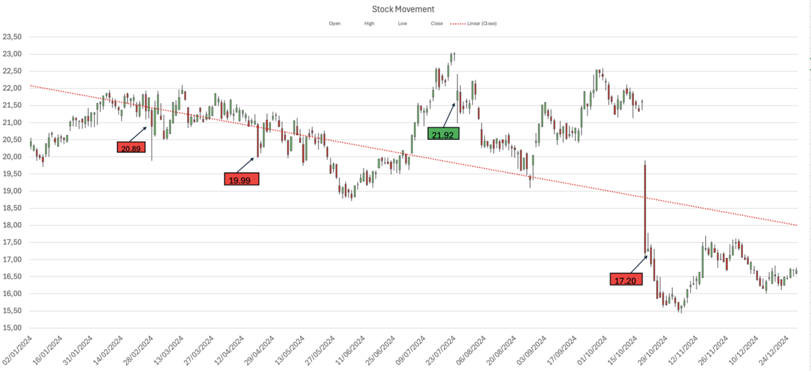
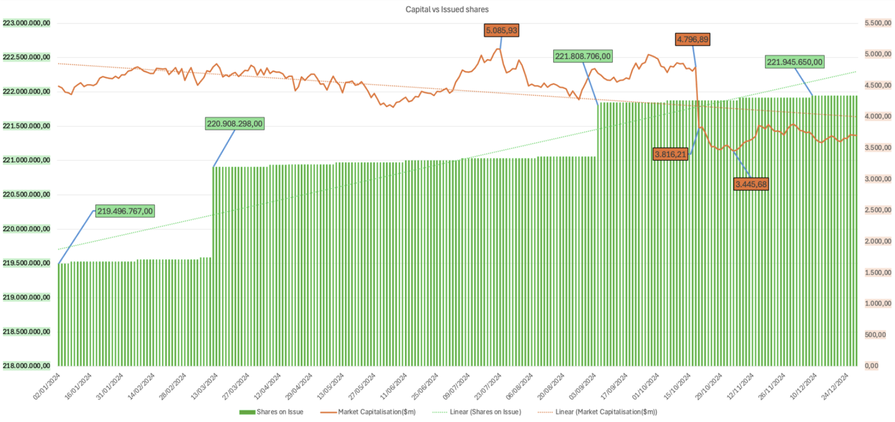
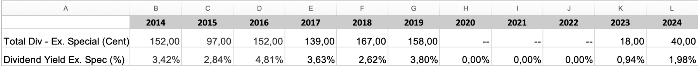
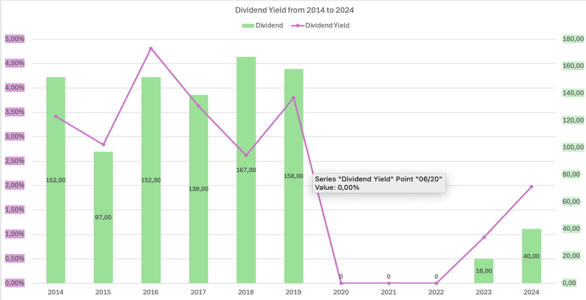
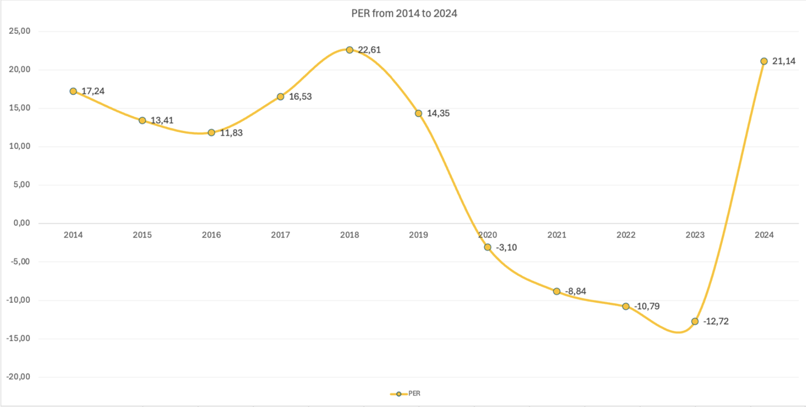
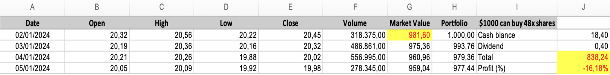
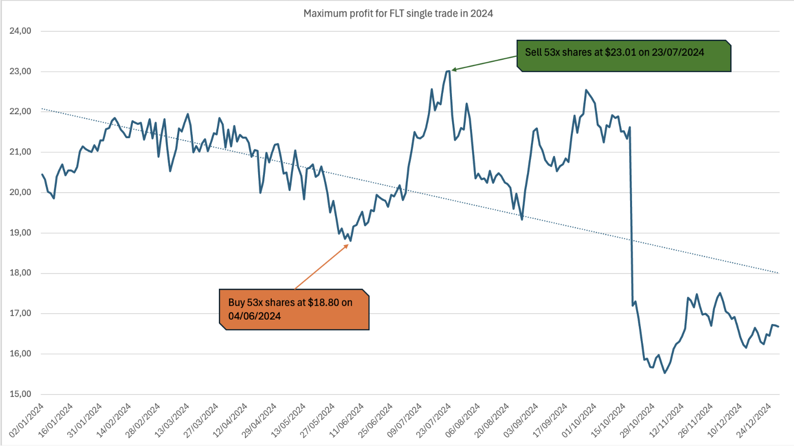
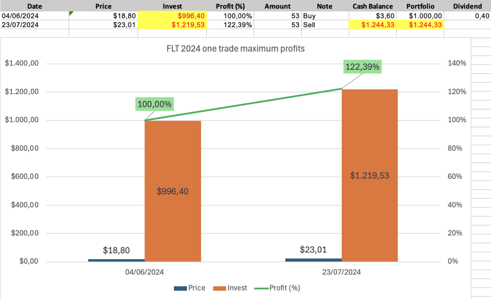
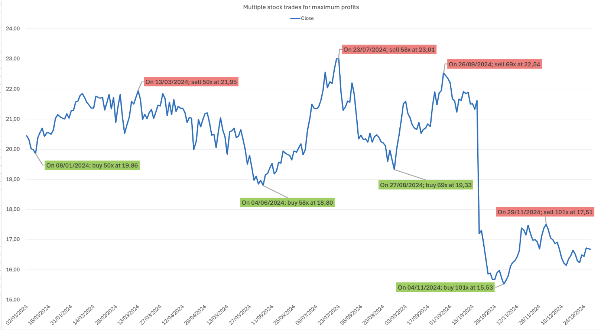

# FLT Stock Data Visualization & Analysis 

## Overview
This project analyzes the 2024 stock performance of **Flight Centre Travel Group Limited (FLT)** listed on the Australian Securities Exchange (ASX).  
Using historical market data from Morningstar, the project applies exploratory data analysis and multiple visualization techniques to uncover price trends, trading behavior, valuation metrics, and investment strategies.

The focus is on data storytelling through visualization, highlighting how different chart types support financial insights.

---

## Data Collection & Storage

### Data Source
- Morningstar – Data Analysis Platform  
- Daily stock price data for FLT (01 Jan 2024 – 31 Dec 2024)

### Dataset Attributes
- ASX Code  
- Company Name  
- Date  
- Open Price  
- High Price  
- Low Price  
- Close Price  
- Trading Volume  
- Market Capitalisation  
- Shares on Issue  
- Dividend  

Additional data (Dividend Yield & P/E Ratio from 2014–2024) was extracted from:
- *Financial Data – Per Share Stats*
- *Financial Data – Ratios*

---

## Data Preparation

- Checked for missing values: **No missing values found**
- Converted `Date` from string to `datetime` format for time-series analysis
- Sorted data chronologically
- Standardized numeric formats for analysis and visualization

---

## Exploratory Data Analysis (EDA)

| Variable | Type | Description |
|-------|------|------------|
| ASX Code | Categorical (Nominal) | Unique stock ticker |
| Company Name | Categorical (Nominal) | Flight Centre Travel Group Limited |
| Date | Quantitative (Interval) | Trading date |
| Open / High / Low / Close | Quantitative (Ratio) | Daily stock prices |
| Volume | Quantitative (Ratio) | Shares traded per day |
| Market Capitalisation | Quantitative (Ratio) | Market value of outstanding shares |
| Shares on Issue | Quantitative (Ratio) | Total issued shares |
| Dividend | Quantitative (Ratio) | Profit distribution to shareholders |

---

## Visual Analysis & Insights

### 1. Close Price vs Trading Volume

**Chart Type:** Dual-axis combo chart

**Key Insights**
- Overall **price downtrend** with increasing trading volume
- High volume during price declines indicates **selling pressure**
- Significant event on **18/10/2024**: sharp price drop accompanied by extreme volume spike

**Notable Extremes**
- Highest Close: $23.01 (23/07)
- Lowest Close: $15.53 (04/11)
- Highest Volume: 8,260,856 (18/10)

---

### 2. Stock Price Movement (OHLC)

**Chart Type:** Candlestick chart

**Key Trends**
- Early-year upward momentum followed by long-term decline
- High volatility from May to November
- Sharp sell-offs indicate reaction to negative market sentiment

**Major Price Movements**
- +22.34% rise from June to July
- −20.45% drop between 17/10 and 18/10
- Stabilization and early recovery signs in December

---

### 3. Market Capitalisation vs Shares on Issue

**Chart Type:** Dual-axis combo chart

**Key Insights**
- Shares on issue increased gradually
- Market capitalisation declined overall
- Market value drops occurred **without share dilution**, indicating price-driven losses

**Critical Event**
- **17/10/2024**: Market cap fell from $4,796.89M to $3,816.21M with no change in issued shares

---

### 4. Dividend Yield Analysis (2014–2024)

**Chart Type:** Dual-axis combo chart

**Key Observations**
- Strong dividends before 2020
- Zero dividends from 2020–2022 (likely COVID impact)
- Dividend resumed in 2023 and increased in 2024
- Dividend yield recovery suggests improving financial health

---

### 5. Price-to-Earnings (P/E) Ratio Analysis

**Chart Type:** Line chart

**Insights**
- Peak P/E of 22.61 in 2018 (high growth expectations)
- Negative P/E from 2020–2023 indicates net losses
- Strong recovery to **21.14 in 2024**, signaling renewed profitability and investor confidence

---

## Portfolio Performance Analysis

### Buy-and-Hold Strategy (2024)
- Initial Portfolio: $1,000
- Shares Purchased: 48 * $20.45
- Portfolio Value (31/12/2024): $838.24
- **Annual Return:** −16.18%

**Conclusion:** Buy-and-hold underperformed due to sustained downtrend.

---

### Single Trade Strategy (Max Profit)

- Buy: 04/06/2024 - 53 x $18.80 = $996.40
- Sell: 23/07/2024 - 53x $23.01 = $1219.53
- **Profit:** +22.39%

This trade captured the strongest upward swing of the year.

---

### Multiple Trades Strategy

- Identified 4 major trading opportunities
- Capital grew from $1,000 → $1,797.75
- **Total Return:** +127.13%
  

Multiple trades significantly outperformed buy-and-hold.

---

## Conclusion & Recommendations

### Key Findings
- FLT stock exhibited an overall **downtrend in 2024**
- Dividend and P/E recovery indicate improving fundamentals
- Short-term trading strategies significantly outperformed passive holding

### Investment Outlook
- FLT is not yet a strong dividend stock
- Improving dividends and earnings suggest **long-term recovery potential**
- Suitable for **active trading** rather than passive investment

---

## Visualization Techniques Used

- **Combo Charts**: Compare metrics with different units (price, volume, profit)
- **Candlestick Charts**: Reveal intraday volatility and market sentiment
- **Line Charts**: Track long-term trends and valuation metrics

Each visualization was optimized through axis rescaling, trend lines, annotations, and color encoding to improve clarity and storytelling.

---

## Tools
- Microsoft Excel 
- Morningstar Data Analysis Platform

